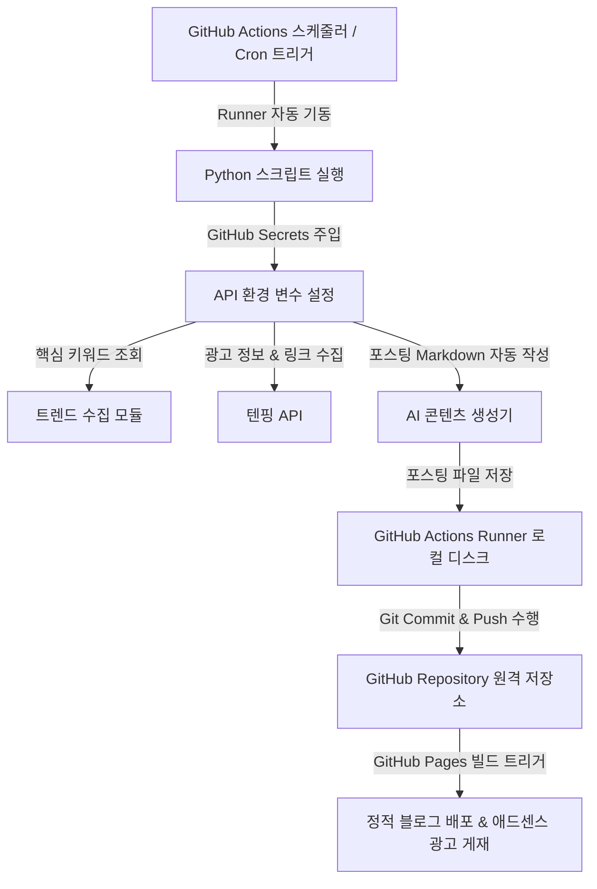

# 10ping (자동화 수익 시스템) - 기획 및 설계서

본 프로젝트는 **텐핑(Tenping) 제휴 마케팅**과 **구글 애드센스(Google AdSense)** 수익을 극대화하기 위해, 콘텐츠 생산부터 배포까지의 과정을 완전 자동화하는 **Python 기반 자동화 시스템**입니다.

이 시스템은 개인 PC를 24시간 켜둘 필요 없이, **GitHub Actions (클라우드 스케줄러)** 상에서 파이썬 코드가 특정 시간마다 자동으로 실행되어 글을 생성하고 원격 저장소(`koreameme002/10ping`)에 자동으로 푸시(Push)하도록 설계되었습니다.

---

## 1. 시스템 개요
GitHub Actions 가상 머신(Runner)이 특정 주기(예: 매 6시간)마다 기동하여 Python 프로그램을 실행합니다. 프로그램은 트렌디한 키워드와 텐핑 제휴 광고 정보를 수집하고, AI를 활용해 고품질의 리뷰 포스팅 마크다운(`.md`) 파일을 자동 생성합니다. 생성된 파일은 GitHub Actions 내부에서 자동으로 Git Commit 및 Push되어 **GitHub Pages 블로그**에 즉각 반영됩니다.

### 💡 핵심 수익 모델
1. **텐핑 제휴 수익**: 포스팅 본문의 텐핑 제휴 링크를 클릭하여 참여 및 가입 유도 시 실시간 **수수료** 적립
2. **구글 애드센스 수익**: GitHub Pages 블로그 테마에 구글 애드센스 광고 스크립트를 삽입하여 유입자에게 광고를 노출하여 수익 발생

---

## 2. 시스템 구성 및 아키텍처

자동화 파이프라인은 다음과 같이 클라우드 기반으로 작동합니다.



### 🛠 모듈별 핵심 기능 (Python 구현)
1. **GitHub Actions 워크플로우 (`.github/workflows/auto_post.yml`)**:
   - 정해진 스케줄(Cron)에 따라 자동으로 가상 머신을 켜서 Python 환경을 초기화하고 의존성 패키지를 설치한 후 `main.py`를 실행합니다.
   - 실행 결과 생성된 마크다운 포스트 파일을 원격 저장소(`koreameme002/10ping`)로 자동으로 커밋 및 푸시합니다.
2. **트렌드 & 키워드 분석 모듈 (`keyword_analyzer.py`)**:
   - 구글 트렌드 및 네이버 데이터랩 쇼핑 인사이트 등에서 실시간 또는 최근 급상승 검색어/인기 키워드를 수집합니다.
3. **텐핑 연동 모듈 (`tenping_partner.py`)**:
   - 수집된 키워드를 활용해 텐핑 광고 API를 조회하고, 개인 제휴 링크(소문링크) 및 이미지를 추출합니다.
4. **AI 콘텐츠 생성 모듈 (`content_writer.py`)**:
   - OpenAI API 또는 Google Gemini API를 연동하여 블로그 프론트매터(제목, 태그, 날짜 등)가 포함된 가독성 높은 제휴 마케팅 포스팅 마크다운 문서를 자동으로 작성합니다.

---

## 3. 개발 로드맵 (Roadmap)

* [x] **1단계: 시스템 설계 및 환경 구축**
  - 개발 환경 세팅 (Python 가상환경 및 `.gitignore` 설정)
  - GitHub 원격 저장소(`koreameme002/10ping`) 연동
  - API Key 연동 환경 구축 (`.env` 설정 및 GitHub Secrets 가이드)
* [x] **2단계: 텐핑 API 연동 및 제휴 광고 수집 개발**
  - 광고 목록 조회 및 딥링크 추출 구현
* [x] **3단계: AI 글쓰기 템플릿 및 API 연동**
  - LLM API 활용 고품질 마크다운(Front Matter 포함) 본문 생성 자동화
  - AI 뉴스 및 실시간 이슈 RSS 피드 수집/변환 개발 완료
* [x] **4단계: GitHub Actions 자동 실행 및 Auto Commit/Push 구축**
  - `.github/workflows/auto_post.yml` 작성 및 실행 테스트 (14개 시간대 다중 크론 스케줄 완료)
  - Actions 실행 중 커밋/푸시 권한 설정
* [x] **5단계: 스케줄링 운영 및 배포 모니터링**
  - 주기적 자동 포스팅 작동 및 애드센스 연동 상태 점검 (Jekyll minima 기반 전역 애드센스 연동 완료)

---

## 🔑 GitHub Secrets 설정 및 보안 가이드

프로젝트가 공개 저장소(Public Repo)로 운영될 경우, API Key 노출을 막기 위해 깃허브 저장소 설정에서 반드시 다음 Secrets를 추가해야 합니다.

### 🐙 GitHub Secrets 등록 방법
1. GitHub의 `koreameme002/10ping` 리포지토리로 이동합니다.
2. **Settings** -> **Secrets and variables** -> **Actions** 메뉴를 클릭합니다.
3. **New repository secret** 버튼을 눌러 다음 키들을 추가합니다.

* `OPENAI_API_KEY`: OpenAI API 호출용 인증 키 (선택사항 — Gemini 키가 있으면 없어도 됨)
* `GEMINI_API_KEY`: Google Gemini API Key (**무료** — [Google AI Studio](https://aistudio.google.com/app/apikey)에서 무료 발급)
* `TENPING_MEMBER_ID`: 텐핑의 개인 MemberID (링크 발급용 식별자)
* `GH_PAT`: GitHub Actions가 본인의 리포지토리에 커밋 및 푸시할 수 있도록 권한을 주는 Personal Access Token (또는 워크플로우 권한 설정을 변경하여 `GITHUB_TOKEN`에 쓰기 권한 부여 가능)
* `TELEGRAM_BOT_TOKEN`: 텔레그램 알림 봇 API 토큰
* `TELEGRAM_CHAT_ID`: 텔레그램 알림 수신 대상 채팅 ID (개인 ID 또는 그룹 ID)

---

## 🔑 로컬 사전 준비물
로컬에서 개발 및 테스트를 수행하기 위해 프로젝트 루트에 `.env` 파일을 생성하여 다음과 같이 환경 변수를 관리합니다. *(이 파일은 `.gitignore`에 의해 GitHub에 올라가지 않습니다)*

```env
OPENAI_API_KEY=your_openai_api_key_here
GEMINI_API_KEY=your_gemini_api_key_here
TENPING_MEMBER_ID=your_tenping_member_id_here
```

---

## 🚀 로컬 실행 및 강제 테스트 방법

로컬 터미널에서 다음 명령어를 통해 수동으로 포스팅을 생성하고 작동을 확인할 수 있습니다:

```bash
# 기본 실행 (KST 현재 시각에 따라 자동으로 카테고리 판별)
python main.py

# 특정 카테고리 강제 실행
python main.py --category health        # 건강 정보 + 텐핑 제휴 상품 매칭
python main.py --category ai_news       # 구글 뉴스 RSS 기반 AI 소식 + 슬라이드 배너
python main.py --category latest_issue  # 구글 트렌드 실시간 이슈 + 슬라이드 배너
```

## 🛠️ Jekyll 및 구글 애드센스 설정 정보
- Jekyll의 기본 테마인 `minima`가 설정되어 있으며, 구글 애드센스 퍼블리셔 ID(`ca-pub-8780669609800607`)는 `_includes/adsense.html`에 연동되어 있습니다.
- 모든 포스트는 `_layouts/default.html` 레이아웃을 참조하며, 헤더 영역에 애드센스 광고 코드가 전역 적용되어 유입자 대상 광고 게재 준비가 완료되었습니다.
